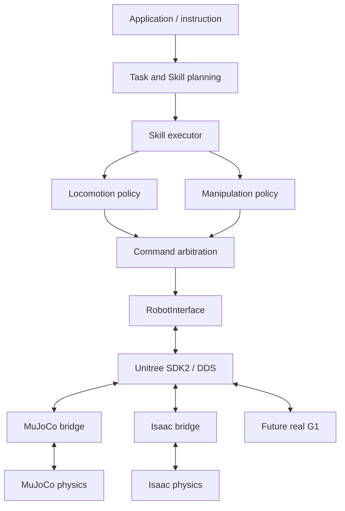

# Análisis y arquitectura

Análisis de código realizado el 12 de septiembre de 2026, antes de implementar
el scaffold. Repositorios inspeccionados:

- MuJoCo: `254339e04b12f38c408cbf5163b8b2f540014477`.
- Isaac: `3ceb704a3af8f2fd83c2c2f583936b9f7d59a78a`.

## Qué existe y qué se reutiliza

| Aspecto | MuJoCo FullStack | Humanoid Assistant |
|---|---|---|
| Propósito | Locomanipulación modular ROS 2; desarrollo de brazos | Demo de asistencia con planificación y traslado de objeto |
| Estructura | Paquetes colcon en `src`, scripts, tests y documentación `exp` | `DEMO/{planner,perception,skills}`, executor, evaluación y launchers |
| Robot | MJCF/URDF G1 29 DOF, meshes, base soldada por defecto | G1 USD referenciado bajo `/World/robot`, resolución de prims/joints |
| Control | MoveIt → JointTrajectoryController → ros2_control → esfuerzo MuJoCo | APIs directas SingleArticulation y transformaciones USD |
| Estado | `/joint_states`, TF y estado de base flotante | Lecturas de articulación y `WorldState`, ground truth y RGB-D |
| Tareas | Poses de brazos, acción Pick; backend físico de grasp pendiente | go_to, pick, place, planificación A*, cuRobo y attach cinemático |
| SDK2 | No encontrado en el workflow inspeccionado | No encontrado en el workflow inspeccionado |

MuJoCo se lanza con `source scripts/activate.sh` y `./scripts/sim.sh`, o
`ros2 launch g1_bringup simulation.launch.py` tras bootstrap/build/source del
workspace. `fixed_base:=false` libera la pelvis; aún necesita balance. Su
controlador declara 500 Hz y joint states 100 Hz. MoveIt usa grupos izquierdo,
derecho y ambos; `whole_body_controller` recibe trayectorias y aplica esfuerzo.
`g1_interfaces/action/Pick.action` incluye feedback de fase y estado de attachment;
`srv/Grasp.srv` exige confirmación física. El servidor falla si falta `/g1/grasp`.
ACT Okura tiene carga/inferencia experimental, sin agarre Dex1 validado.

Isaac se ejecuta con `./run_demo.sh`, que usa `run_demo_standalone.py`, el Python
de Isaac y runtimes locales de cuRobo/Qwen. Ese launcher contiene una ruta de
instalación absoluta: el orquestador la reemplaza por configuración, sin editarlo.
La escena principal es `EntornoPisoMesas_limpio.usda`; G1 y mobiliario son payloads
remotos, por lo que clonar Git no descarga todos los assets.

El código de navegación usa `set_world_pose`: desplaza XY y orienta el root.
El launcher pausa el timeline; manipulación inicializa la articulación sin
gravedad y aplica posiciones articulares. cuRobo planifica principalmente cintura
y brazo derecho; el objeto se mueve por attach/detach. No es locomoción física,
agarre por contacto ni manipulación bimanual validada. La RGB-D actual está fija
en el entorno, clonada de una cámara elevada; no está en la cabeza del G1.
El repositorio usa Isaac Sim, no se identificó un entorno Isaac Lab de entrenamiento.

Reutilización inmediata del MVP: MJCF, meshes, escena MuJoCo y USD Isaac como
referencias externas. No se copian al core ni se ejecutan las demos heredadas.
Reutilización posterior sin duplicación:

- Isaac `DEMO/skills/path_planner.py`: A* puro, adaptable a un mapa común.
- `perception/world_state.py`, `planner/goal_planner.py` y `plan_validation.py`:
  modelos simbólicos y validación; requieren adaptar nombres de entidades y imports.
- `DEMO/evaluation.py`: casos/resultados, aunque su éxito por ubicación simbólica
  no demuestra contacto físico. Sus imports top-level requieren empaquetado o
  carga aislada; no agregar todo `DEMO` al `sys.path` global del core.
- MuJoCo MoveIt/URDF/colisiones y contratos Pick/Grasp: mantener como servicio
  de planificación externo. Su ejecución ros2_control no se vuelve SDK2 por
  renombrar topics: la ruta de ejecución futura debe pasar por el contrato común.
- Checkpoints ACT/policies: conectar a protocolos de políticas después de
  validar observaciones, orden de joints, escalas y frecuencia.

Específico de cada simulador: carga y reset de escena, acceso a articulaciones,
física/contactos, aplicación de esfuerzo, sensores/render, conversiones de
frames, gravedad/fixtures y ciclo de stepping.

## Decisión de integración

Usar **submódulos fijados + adapters + procesos independientes**. Los submódulos
preservan historial, permiten actualización explícita y registran la revisión
usada. No usar dependencias pip apuntando a estos repos completos: MuJoCo es un
workspace ROS y el proyecto Isaac requiere su runtime, no paquetes instalables
intercambiables. Empaquetar posteriormente sólo componentes puros si sus repos
ofrecen una API mantenida. Evitar copiar árboles o fusionar entornos Python.

Actualizar un submódulo es una decisión de versión: hacer checkout del commit
deseado en `external/<sim>`, ejecutar los contratos y registrar el gitlink desde
el repo padre. No usar actualizaciones automáticas a la última rama en benchmarks.

## Árbol implementado

```text
unitree-g1-sim2real/
├── pyproject.toml
├── README.md
├── configs/{common,mujoco,isaac}.yaml
├── src/g1_sim2real/
│   ├── contracts.py      # robot, comandos futuros, planning, policies, percepción
│   ├── config.py         # composición y validación
│   ├── dds.py            # Unitree HG publisher/subscriber y conversión
│   ├── backends.py       # carga/lectura específica, sólo en proceso hijo
│   └── runner.py         # experimento común, ciclo de vida y resultados
├── scripts/{run,bridge,evaluate}.py
├── external/{mujoco,isaac}/  # submódulos independientes
├── experiments/runs/       # generado, ignorado por Git
├── tests/test_contracts.py
└── docs/architecture.md
```

Cuando exista lógica concreta, dividir `contracts.py` en `robot`, `planning`,
`perception`, `skills`, `policies/locomotion` y `policies/manipulation`. Separar
también `backends.py` y evaluación cuando crezcan. No crear ahora esos árboles
con archivos vacíos. La configuración futura de cámaras, checkpoints, tareas y
randomización se añadirá cuando un componente la consuma.

## Flujo objetivo y frontera DDS



El diagrama representa el objetivo, no todas las capacidades del MVP.
WHAT decide tareas y skills; HOW produce navegación, trayectorias o comandos.
La arbitrariedad de políticas no debe permitir dos escritores simultáneos del
mismo motor: definir ownership de piernas/cintura/brazos antes del control.
El experimento y la lógica común no deben depender de `--sim`; ese argumento
selecciona configuración, intérprete, adapter y assets.

El SDK oficial usa CycloneDDS y tipos IDL. Para G1 el bridge oficial MuJoCo usa
`unitree_hg.msg.dds_.LowCmd_`/`LowState_`, con `rt/lowcmd`/`rt/lowstate`.
ROS 2 también puede usar DDS, pero sus mensajes y convenciones no equivalen
automáticamente al protocolo Unitree. Es preciso compartir tipos, serialización,
semántica, QoS compatible, índices y modos; no necesariamente una librería binaria.

Referencias:
[SDK2 Python](https://github.com/unitreerobotics/unitree_sdk2_python),
[bridge oficial MuJoCo](https://github.com/unitreerobotics/unitree_mujoco/blob/main/simulate_python/unitree_sdk2py_bridge.py),
[articulaciones Isaac 5.1](https://docs.isaacsim.omniverse.nvidia.com/5.1.0/python_scripting/robots_simulation.html).

No se reutiliza literalmente el bridge oficial MuJoCo: asume sensores y layout
específicos. Este MVP resuelve qpos/dof por nombres del modelo del usuario.
Isaac resuelve igualmente nombres, sin asumir que su orden interno sea SDK2.
Sólo 29 joints corporales se incluyen; las manos necesitan protocolo/modelo propio.

## Alcance comprobable del MVP

El core abre un subscriber SDK2, lanza el bridge en otro proceso y espera estados
nuevos con timeout. El bridge carga los assets externos y publica lecturas del
simulador. MuJoCo usa `mj_forward` sin integración; Isaac inicializa la articulación
y pausa el timeline. Son escenas pausadas, no episodios físicos equivalentes.
El contador aumenta por publicación, no por paso físico.

El mensaje tiene CRC calculado por SDK2, pero el consumidor del MVP no valida
CRC recibido ni acepta comandos. Los campos distintos de q/dq son defaults IDL,
no sensores válidos; `RobotState` no los expone. El dominio de simulación y `lo`
se validan. No hay publicación de `LowCmd`, RPC de locomoción ni backend real.

El siguiente incremento requiere `tau = tau_ff + kp*(q_des-q) + kd*(dq_des-dq)`,
modos G1/ankle adecuados, saturación por motor, freshness/watchdog y validación
de CRC. Aplicar ese esfuerzo en ambos motores físicos y desactivar controladores
o drives que compitan. Un puente DDS→trayectoria ROS no preserva esa semántica.
Un `go_to` de alto nivel tampoco aparece por implementar `LowCmd`: hace falta
una policy/controlador de locomoción. El SDK transporta; no aporta equilibrio.

## Experimentos equivalentes y evaluación

Antes del traslado de caja hay que igualar variantes G1/manos, geometría de mesas
y caja, masas/inercia, fricción, límites, poses iniciales, frames/unidades,
frecuencias de control/física, observaciones y política/checkpoint. Separar diferencias
inevitables de solver de diferencias accidentales en el escenario. Mapear table_C
de la demo Isaac a un identificador común Table_B si representa el mismo destino.

Agregar reset/seed, tiempo simulado separado del monotónico, criterios explícitos
de contacto/caída y resultados de skills (running/success/failure). El éxito
bimanual requiere agarre físico y traslado sin attach artificial. La cámara
necesita extrínsecos de cabeza, intrínsecos, profundidad en metros y timestamps.

El registro actual guarda config, revisión externa, q/dq, recepción monotónica,
conteo de muestras, error y duración total incluyendo arranque/cierre. No usar
esa duración como completion time de una tarea ni como latencia de control.
Las demás métricas se incorporarán como campos versionados con unidad, reloj,
origen y disponibilidad; ausente/null nunca equivale a cero:

- Tareas: success rate, completion time, grasp success y trajectory error.
- Física: contactos, colisiones, estabilidad, caídas y perturbaciones.
- Sistema: control/camera latency, FPS, steps/s, CPU, GPU, RAM y VRAM.
- Comparación: casos/semillas repetidos, versiones de assets/checkpoints, hardware
  y configuración efectiva. Sim-to-real gap sólo después de medidas del robot real.

Por ahora `evaluate.py` agrega únicamente éxito de telemetría por simulador;
no compara rendimiento físico ni mezcla esas tasas con éxito de manipulación.

## Limitaciones y validación

No se reescribieron ni modificaron los repositorios externos. La nueva ruta
reutiliza assets; la lógica de sus demos aún no está conectada al core. Eso es
deliberado para no arrastrar control cinemático o ros2_control a una falsa
equivalencia DDS. Los protocolos futuros no son implementaciones operativas.

Los tests locales cubren merge/validación, mapping por nombres, datos inválidos,
freshness y carga real del MJCF cuando MuJoCo está instalado. Validar Isaac requiere
su instalación, GPU y resolución de payloads USD. No afirmar compatibilidad de
Isaac basándose en estos tests. La prueba end-to-end exige ejecutar ambos comandos
sin `--check`, observar estados en DDS y revisar `result.json` y `backend.log`.

Validación realizada en esta sesión:

- 7 tests pasaron con Python 3.12, incluida carga del MJCF externo en MuJoCo 3.13.0.
- `--check` pasó para ambas configuraciones.
- MuJoCo end-to-end por SDK2/DDS pasó: 20 estados recibidos, exit code 0, corrida
  `20260912T205111Z-5d0b7594` en `experiments/runs` (artefactos locales ignorados).
- SDK2 `65691c8` instalado editable; CycloneDDS Python 0.10.2 y nativo 0.10.5.
- Se detectaron y resolvieron incompatibilidad con Python 3.13 y ausencia de CRC
  en el wheel de SDK2. Las instrucciones del README reflejan la instalación probada.
- La prueba DDS necesitó sockets de loopback fuera del sandbox de herramientas.
- Isaac no fue ejecutado: no se encontró su runtime en las rutas accesibles.
- Los submódulos permanecen sin cambios locales. Los intentos fallidos de
  instalación/comunicación que produjeron resultados se conservan como corridas
  fallidas; el agregado incluye esos intentos de desarrollo.
